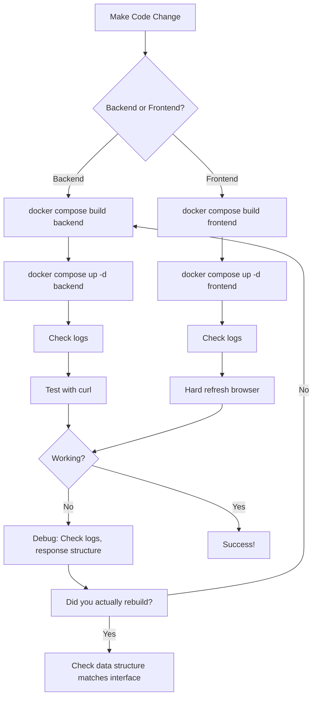

# Claude Development Guide - Sovereign Council

This document contains critical workflows, checklists, and reminders for maintaining development rigor when working on this project.

## 🔴 CRITICAL: Docker Workflow

### When Code Changes, REBUILD the Container

**WRONG ❌:**
```bash
# Editing backend/src/main.py
docker compose restart backend  # ❌ This does NOT pick up code changes!
```

**CORRECT ✅:**
```bash
# Editing backend/src/main.py
docker compose build backend    # ✅ Rebuild image with new code
docker compose up -d backend    # ✅ Recreate container with new image
```

### Why This Matters
- Docker containers have code **baked into the image** at build time
- Restarting a container uses the **old image**
- Local file changes are NOT reflected in running containers until rebuilt
- This applies to BOTH backend AND frontend

### Quick Reference

| File Changed | Command Required |
|-------------|-----------------|
| `backend/src/*.py` | `docker compose build backend && docker compose up -d backend` |
| `frontend/src/**/*` | `docker compose build frontend && docker compose up -d frontend` |
| `frontend/nginx.conf` | `docker compose build frontend && docker compose up -d frontend` |
| `docker-compose.yml` | `docker compose down && docker compose up -d` |
| `config/sovereign_council.yaml` | `docker compose restart backend` (config is mounted) |

---

## 📋 Pre-Implementation Checklist

Before making changes:
- [ ] Understand the full data flow (backend → frontend)
- [ ] Check both backend AND frontend for related code
- [ ] Identify all interfaces/contracts between components
- [ ] Plan what needs to change in BOTH backend and frontend

---

## 🔧 Post-Change Verification Checklist

After making backend changes:
- [ ] **REBUILD** the backend image: `docker compose build backend`
- [ ] Recreate the container: `docker compose up -d backend`
- [ ] Check logs for startup errors: `docker compose logs backend --tail 50`
- [ ] Verify the API response with curl (don't trust just the browser)
- [ ] Test in browser with DevTools Network tab open

After making frontend changes:
- [ ] **REBUILD** the frontend image: `docker compose build frontend`
- [ ] Recreate the container: `docker compose up -d frontend`
- [ ] Hard refresh browser (Ctrl+F5) to clear cached JavaScript
- [ ] Check browser console for errors
- [ ] Verify Network tab shows expected requests/responses

---

## 🔄 GitHub Issue Workflow

### Issue Closure Policy

**IMPORTANT**: Do NOT close issues immediately after implementing a fix.

**Correct Workflow**:
1. Implement the fix
2. Rebuild and deploy containers
3. Test the fix locally (curl, browser, etc.)
4. Commit and push changes
5. Comment on the issue with:
   - Commit hash
   - Root cause explanation
   - Solution implemented
   - Testing performed
6. **WAIT for user verification** before closing
7. Only close the issue after user confirms the fix works

**Why This Matters**:
- User may have different testing scenarios
- Fix may work in development but not in user's environment
- User may identify edge cases or additional requirements
- Premature closure creates confusion and requires reopening

### Issue Comment Template

When posting fix details:
```
Fixed in commit [hash].

**Root Cause**: [explanation]

**Solution**: [what was changed and why]

**Testing**: [what tests were performed]

Please verify this resolves the issue in your environment.
```

---

## 🧪 Testing Workflow

### 1. Test API Endpoints Directly (Before Browser Testing)

Always test backend changes with curl FIRST:

```bash
# Test health endpoint
curl http://localhost:3000/api/health

# Test POST deliberate endpoint
curl -X POST http://localhost:3000/api/deliberate \
  -H "Content-Type: application/json" \
  -d '{"question":"What is 2+2?"}'

# Test SSE stream endpoint (with timeout)
timeout 180 curl -N "http://localhost:3000/api/deliberate/stream?question=test"
```

### 2. Inspect Actual Response Data

Don't assume the response is correct - verify it:

```bash
# Save response to file for inspection
curl -X POST http://localhost:3000/api/deliberate \
  -H "Content-Type: application/json" \
  -d '{"question":"test"}' > /tmp/response.json

# Pretty-print and inspect
cat /tmp/response.json | python -m json.tool
```

### 3. Browser Testing

Only after curl tests pass:
- Open DevTools BEFORE submitting request
- Watch Network tab for actual request/response
- Check Console tab for JavaScript errors
- Verify Response Preview shows expected structure

---

## 🐛 Debugging Workflow

### When Something Doesn't Work

1. **Verify the container is using new code**
   ```bash
   # Check container creation time
   docker compose ps

   # If "Created" time is before your code change, you forgot to rebuild!
   docker compose build <service>
   docker compose up -d <service>
   ```

2. **Check logs for errors**
   ```bash
   docker compose logs backend --tail 50
   docker compose logs frontend --tail 50
   ```

3. **Verify the API response structure**
   ```bash
   curl -s http://localhost:3000/api/endpoint | python -m json.tool
   ```

4. **Check browser console AND network tab**
   - Console: JavaScript errors
   - Network: Actual request/response data

5. **Compare backend output to frontend expectations**
   - Read the TypeScript interface in `frontend/src/app/models/index.ts`
   - Compare to the Python dataclass in `backend/src/council.py`
   - Ensure response structure matches EXACTLY

---

## 🏗️ Architecture Reminders

### Data Flow
```
Browser → nginx (localhost:3000) → backend (backend:8000) → Ollama (host.docker.internal:11434)
```

### Key Contracts

**SSE Stream Events:**
```json
{"type": "status", "message": "..."}
{"type": "complete", "deliberation": {...}}
{"type": "error", "message": "..."}
```

**Deliberation Response Structure:**
```json
{
  "synthesis": {
    "content": "...",
    "consensus_points": [...],
    "divisions": [...],
    "unique_insights": [...],
    "confidence": {...}
  },
  "perspectives": [
    {
      "member_id": "...",
      "model": "...",
      "character": "...",
      "content": "...",
      "timestamp": "..."
    }
  ]
}
```

### Common Mismatches to Watch For

- Backend sends `id`, frontend expects `member_id`
- Backend sends string, frontend expects object
- Backend sends nested structure, frontend expects flat
- Missing required fields (model, timestamp, etc.)

---

## 🚨 Common Pitfalls

### 1. Restarting Instead of Rebuilding
**Symptom:** "I changed the code but it's still broken"
**Cause:** Container is using old image
**Fix:** `docker compose build <service> && docker compose up -d <service>`

### 2. Testing in Browser Before Verifying API
**Symptom:** "Browser shows errors but I can't tell why"
**Cause:** Assuming backend is working without testing
**Fix:** Always test with curl first

### 3. Frontend JavaScript Caching
**Symptom:** "Frontend shows old behavior after rebuild"
**Cause:** Browser cached old JavaScript
**Fix:** Hard refresh (Ctrl+F5) or clear cache

### 4. Not Checking Container Logs
**Symptom:** "Container is running but not working"
**Cause:** Container may have startup errors
**Fix:** `docker compose logs <service> --tail 50`

### 5. Forgetting CORS Headers
**Symptom:** "EventSource fails immediately in browser"
**Cause:** nginx proxy needs CORS headers for SSE
**Fix:** Check `frontend/nginx.conf` has CORS headers in `/api/` location

### 6. Docker Network Confusion
**Symptom:** "Can't connect to Ollama"
**Cause:** Using `localhost` instead of `host.docker.internal`
**Fix:** In Docker, `localhost` = container itself, not host machine

---

## 📝 Quick Commands Reference

### Docker Operations
```bash
# Rebuild and restart everything
docker compose down
docker compose build
docker compose up -d

# Rebuild single service
docker compose build backend
docker compose up -d backend

# View logs
docker compose logs -f backend
docker compose logs -f frontend

# Check status
docker compose ps

# Full reset (nuclear option)
docker compose down
docker compose build --no-cache
docker compose up -d
```

### Verification Commands
```bash
# Test backend health
curl http://localhost:3000/api/health

# Test SSE stream (with timeout for long deliberations)
timeout 180 curl -N "http://localhost:3000/api/deliberate/stream?question=test"

# Check if Ollama is reachable from host
curl http://localhost:11434/api/tags

# View container file to verify changes (example)
docker compose exec backend cat /app/src/main.py | grep -A 5 "synthesis"
```

---

## 🎯 Best Practices

1. **Always rebuild after code changes**
2. **Test API before testing browser**
3. **Check logs after every deployment**
4. **Verify response structure matches frontend expectations**
5. **Use curl to inspect actual API responses**
6. **Clear browser cache when frontend misbehaves**
7. **Check Docker container creation time to ensure it's recent**

---

## 📚 Project-Specific Notes

### Session Logs
Check `docs/SESSION_*.md` for historical debugging sessions and lessons learned.

### Configuration
- Privacy mode must be "citadel" for Docker deployment
- Gateway URL must use `host.docker.internal:11434` not `localhost:11434`
- Models must be actually pulled in Ollama before use

### Known Issues
- Small models (0.5-1.1B) are slow on CPU, deliberations take 2-3 minutes
- nginx default timeout is 60s, but deliberations need longer
- SSE streaming solves timeout issues by keeping connection alive

---

## 🔄 Workflow Summary



---

## ✅ Final Checklist Before Saying "Done"

- [ ] Code changes made
- [ ] Docker image rebuilt (not just restarted)
- [ ] Container recreated with new image
- [ ] Logs checked for errors
- [ ] API tested with curl
- [ ] Response structure verified
- [ ] Browser tested with DevTools open
- [ ] No console errors
- [ ] UI displays data correctly
- [ ] Both POST and SSE endpoints work (if applicable)
- [ ] Issue commented with fix details (if applicable)
- [ ] Waiting for user verification before closing issue

---

**Remember: Docker containers are immutable. Code changes require image rebuilds, not just restarts.**
